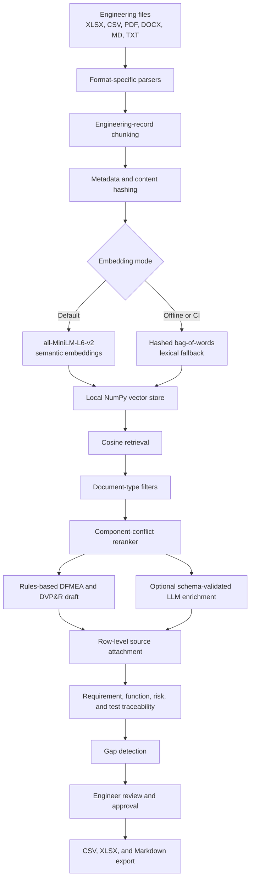

# Architecture

## System intent

This project is a hybrid engineering AI system. Deterministic domain rules create the baseline DFMEA and DVP&R structure. Retrieval attaches relevant historical evidence. Optional LLM enrichment can propose additional cited rows, but it is disabled by default and never approves engineering content.

## Retrieval path

1. `rag/loader.py` parses each supported format.
2. Spreadsheet rows become one chunk per engineering record. Text documents are divided into bounded, overlapping chunks.
3. Metadata preserves source file, sheet, row, document type, source strength, component, failure mode, and risk category.
4. `rag/embeddings.py` selects MiniLM unless fallback is explicitly forced or the semantic model cannot initialize.
5. `rag/store.py` stores JSON metadata and NumPy vectors. Content hashes prevent duplicate chunks.
6. `rag/retriever.py` performs cosine retrieval, metadata filtering, and component-conflict reranking.
7. Generated rows receive source file, sheet, row, chunk ID, evidence preview, confidence, component-match classification, and a change-log event.
8. A retrieval below the configured threshold remains a visibly labeled rules-based fallback.

## Generation path

The application does not ask an LLM to create an entire safety-related analysis from an unconstrained prompt. The baseline generation path uses explicit engineering categories, functions, requirements, failure-mode rules, validation profiles, and AIAG-VDA-aligned Action Priority logic. Retrieval then provides supporting evidence or a visible fallback state.

Optional LLM enrichment operates behind additional controls:

- retrieved context is supplied to the model;
- output must match the application schema;
- citations must reference real retrieved chunk IDs;
- invalid or invented chunk IDs are removed;
- every proposed row requires engineer review.

## Trust boundaries

- Uploaded files are treated as engineering reference material, not approval authority.
- Synthetic demo records are labeled as synthetic.
- Numerical targets must be entered from controlled requirements or standards.
- Cross-component sources are labeled as analogies.
- Rules-based fallback rows do not receive artificial retrieval confidence.
- Approval, release, validation, and risk acceptance remain human decisions.

## Deployment

The current deployment is a single-process Streamlit application with a local JSON and NumPy vector store. This is suitable for a public prototype and small pilot. A production deployment would separate the UI, retrieval service, persistent database, authentication, authorization, secrets, observability, and audit logging.
