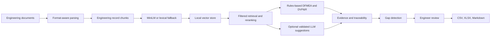

# BIW DFMEA and DVP&R AI Assistant

[](https://github.com/vinayanand3/dfmea-assistant/actions/workflows/ci.yml)
[](https://huggingface.co/spaces/vinayanand2/dfmea-assistant)
[](LICENSE)

A public portfolio case study showing how automotive engineering knowledge can be combined with retrieval, deterministic domain logic, traceability, and human review to create draft BIW DFMEA and DVP&R artifacts.

This is a **hybrid engineering AI system**, not a free-form chatbot. Domain rules create the baseline analysis, retrieval attaches auditable evidence, and an optional LLM can propose schema-validated additions. Engineers remain responsible for every rating, requirement, validation plan, approval, and release decision.

## Why this project exists

DFMEA and validation planning often require engineers to search fragmented historical files, reinterpret prior lessons, and manually prove that every important risk has a test. This prototype explores a more traceable workflow:

1. describe a BIW component;
2. retrieve relevant historical records, standards, and lessons learned;
3. generate structured DFMEA and DVP&R drafts from explicit domain rules;
4. attach row-level source evidence or label the row as a rules-based fallback;
5. check risk-to-test coverage and highlight gaps;
6. require engineer review before export or use.

## Measured retrieval performance

The repository includes a reproducible 30-question, source-specific benchmark with a relevant document, expected citation marker, and unrelated distractor for every query.

| Embedding mode | Recall@1 | Recall@3 | Recall@5 | MRR | Exact citation@1 | Distractor rejection@5 | Average query latency |
|---|---:|---:|---:|---:|---:|---:|---:|
| MiniLM semantic | 93.3% | 100% | 100% | 0.967 | 93.3% | 100% | 7.53 ms |
| Hashed BOW fallback | 96.7% | 100% | 100% | 0.983 | 86.7% | 100% | 0.07 ms |

These are **closed-world synthetic results**, not production accuracy claims. The lexical fallback performs unusually well because the controlled benchmark contains distinctive engineering terms. MiniLM produces better exact top-1 citation-marker accuracy. See [EVALUATION.md](EVALUATION.md) for definitions, methodology, raw artifacts, and limitations.

## Architecture



The detailed data flow, trust boundaries, and deployment model are documented in [ARCHITECTURE.md](ARCHITECTURE.md).

## What the implementation demonstrates

- Multi-format ingestion for XLSX, CSV, PDF, DOCX, Markdown, and text.
- Engineering-record chunking that preserves file, sheet, and row metadata.
- Local semantic embeddings using `all-MiniLM-L6-v2`.
- An explicitly labeled hashed bag-of-words fallback for offline development and CI.
- Cosine retrieval with document-type filters and component-conflict reranking.
- Duplicate prevention through content hashes.
- Expandable full retrieved records with source file, location, chunk ID, and engineering markers.
- Stable requirement, function, failure-mode, action, and test IDs.
- AIAG-VDA-aligned Action Priority logic, with RPN retained as a supporting metric.
- Traceability and gap detection from requirements to risks to validation tests.
- Optional LLM enrichment with schema validation and citation-ID checks.
- Automated tests, benchmark quality gates, and GitHub Actions CI.

## Two-minute demo

1. Open the [live Hugging Face Space](https://huggingface.co/spaces/vinayanand2/dfmea-assistant).
2. Select **Front Rail Reinforcement**, then choose **Load Selected Part**.
3. Choose **Generate Drafts**.
4. In **Knowledge Base**, search `front rail crash folding` and expand **View full retrieved record**.
5. Inspect the DFMEA source fields, the linked DVP&R rows, Traceability, and Gaps.
6. In **Export**, download the review workbook.

Only upload synthetic or approved non-confidential material to the public demo.

## Run locally

```bash
git clone https://github.com/vinayanand3/dfmea-assistant.git
cd dfmea-assistant
python3 -m venv .venv
source .venv/bin/activate
pip install -r requirements.txt
streamlit run app.py
```

No API key is required. The default generation path is deterministic. On first semantic launch, the embedding model is downloaded and cached. If it cannot initialize, the interface clearly reports that the active retriever is lexical fallback rather than semantic retrieval.

For a lightweight offline run:

```bash
RAG_FORCE_FALLBACK_EMBEDDER=1 streamlit run app.py
```

## Reproduce the evaluation

```bash
source .venv/bin/activate
python -m evaluation.run_benchmark --mode semantic
python -m evaluation.run_benchmark --mode fallback
```

The evaluator writes JSON metrics, per-question CSV details, and a Markdown summary to `evaluation/results/`. The benchmark corpus is self-contained in `evaluation/corpus/`.

## Run the tests

```bash
pip install -r requirements-dev.txt
python -m pytest tests -q
```

CI intentionally uses the lightweight fallback embedder so pull requests do not download a large model. Semantic retrieval is benchmarked locally and its checked-in results remain independently reproducible.

## Optional LLM enrichment

Copy `.env.example` to `.env`, set `RAG_LLM_PROVIDER=anthropic` or `openai`, add the provider key, and install its client library. Retrieved context is passed to the model, output must match the application schema, and cited chunk IDs must exist in the retrieved set. Suggestions are labeled for review and are never auto-approved.

## Repository guide

| Path | Purpose |
|---|---|
| `app.py` | Streamlit interface and workflow orchestration |
| `rag/` | loaders, embeddings, storage, retrieval, prompting, and optional LLM integration |
| `logic/` | deterministic engineering generation and export logic |
| `evaluation/` | 30-question benchmark, corpus, evaluator, and measured results |
| `tests/` | unit, integration, evaluation, and end-to-end export tests |
| `examples/parts/` | synthetic component examples |
| `MEDIUM_ARTICLE.md` | copy-ready portfolio article with screenshot placeholders |
| `ARCHITECTURE.md` | system design and trust boundaries |
| `LIMITATIONS.md` | known gaps and production roadmap |

## Responsible use and project status

This repository is a tested public prototype, not an AIAG or VDA certified product and not an engineering release system. Public data and benchmark records are synthetic. It does not currently provide authentication, tenant isolation, enterprise audit logging, malware scanning, or production-grade persistence. Review [LIMITATIONS.md](LIMITATIONS.md) and [SECURITY.md](SECURITY.md) before any pilot.

The design goal is not to replace an engineer. It is to make prior evidence easier to find, make draft reasoning more explicit, and make missing validation coverage harder to overlook.

## Author

Built by Vinay Anand Bhaskarla as a career-transition portfolio project connecting automotive BIW engineering experience with applied AI, retrieval evaluation, data engineering, and responsible human-in-the-loop system design.
